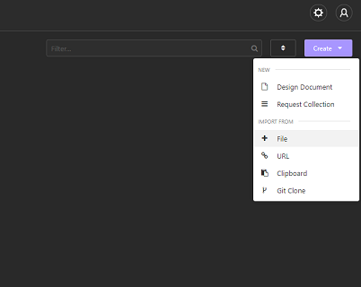

# <ins>E-Commerce Back End</ins>

## <ins>Description</ins>
A back end e-commerce application allowing the user to CRUD(Create, Read, Update, and Delete) data of Categories, Products and Tags using Insomnia.
## <ins>Table of Contents</ins>
- [Installation](#installation)
- [Usage](#usage)
- [License](#license)
- [Features](#features)
- [Contributions](#contributions)
- [Tests](#tests)
- [Questions](#questions)

## <ins>Installation</ins>
Type `npm i` or `npm install` in the integrated terminal to install all depencies for this program.

This Application is utilizing a .env file. You will notice a file named ".env.EXAMPLE". Rename the file ".env" and fill in the `DB_USER` and `DB_PASSWORD` with your mysql login information. 

Open mysql with command `mysql -u root -p` in order to log in to your mysql. Run the schema with `source db/schema.sql` 

`Exit` your sequal and return to your integrated terminal where you will run the seeds with `node seeds` and run the server with `node server.js`

Installation Example:

Open Insomnia and import the template.json file inside of the insomnia file, by selecting create and importing from file.

## <ins>Usage</ins>
 
Insomnia allows you to run different methods on different routes, and for this application we are testing the databases capabilities. The database is capable of handling a POST, GET, PUT and DELETE route for Categories, Tags and Products. The template.json allows you to have the preset functions as well as the appropriate structure for the json for each item. Simply change the values in order to Create, Read, Update or Delete any of the items.

Example of application:
 

## <ins>License</ins>

This project is covered under MIT

## <ins>Questions</ins>
Contact E-Commerce Back End at aabazary@gmail.com. Github link: https://github.com/aabazary
